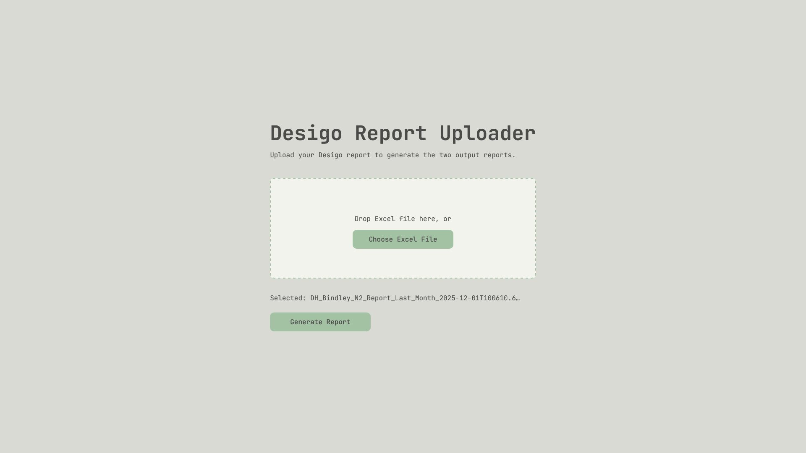

# Desigo Report Uploader

This tool takes the monthly raw data exported from the Desigo system and automatically applies formatting, saving it as two separate report files — one for Bindley and one for Rich. It runs entirely in a web browser with no installation required.

---

## Requirements

- A modern web browser (Chrome, Edge, or Firefox recommended)
- Raw data file exported from Desigo software (`.xlsx` format)

---

## Instructions

1. **Export the monthly data set from the Desigo software** and save it somewhere you can find it.

2. **Open the tool** by navigating to [kylecor.win/projects/desigo-uploader](https://kylecor.win/projects/desigo-uploader) in your browser.

3. **Select your file** by clicking the upload area and browsing to your Desigo export, or drag and drop the file directly onto the page.

4. **Click Generate Reports.**

5. **Two files will download automatically** to your browser's default Downloads folder:
   - `## - Bindley N2 Report Month YYYY.xlsx`
   - `## - Raw N2 Report Month YYYY.xlsx`

   Where `##` is the month number and `Month YYYY` is the full month and year (e.g. `03 - Bindley N2 Report March 2026.xlsx`).

> **Note:** Your browser may ask permission to download multiple files the first time you use the tool. Click **Allow** when prompted.

---

## Troubleshooting

| Issue | Solution |
|---|---|
| Error message after selecting file | Verify the file is a valid `.xlsx` export from Desigo. Other file types or modified exports may not process correctly. |
| Files not appearing in Downloads | Check that your browser did not block the downloads. Look for a blocked download notification in the browser's address bar and click Allow. |
| Browser asks to allow multiple downloads | This is expected on first use. Click Allow — the tool downloads two files each time it runs. |

---

## Version History

| Version | Date | Notes |
|---|---|---|
| 2.0 | March 2026 | Rewritten as a browser-based tool using JavaScript and SheetJS — no installation required |
| 1.0 | December 2025 | Initial release as a Python desktop application |

---

**Developed by Kyle C.**  
For questions or support, contact [kcorwin@purdue.edu](mailto:kcorwin@purdue.edu)
